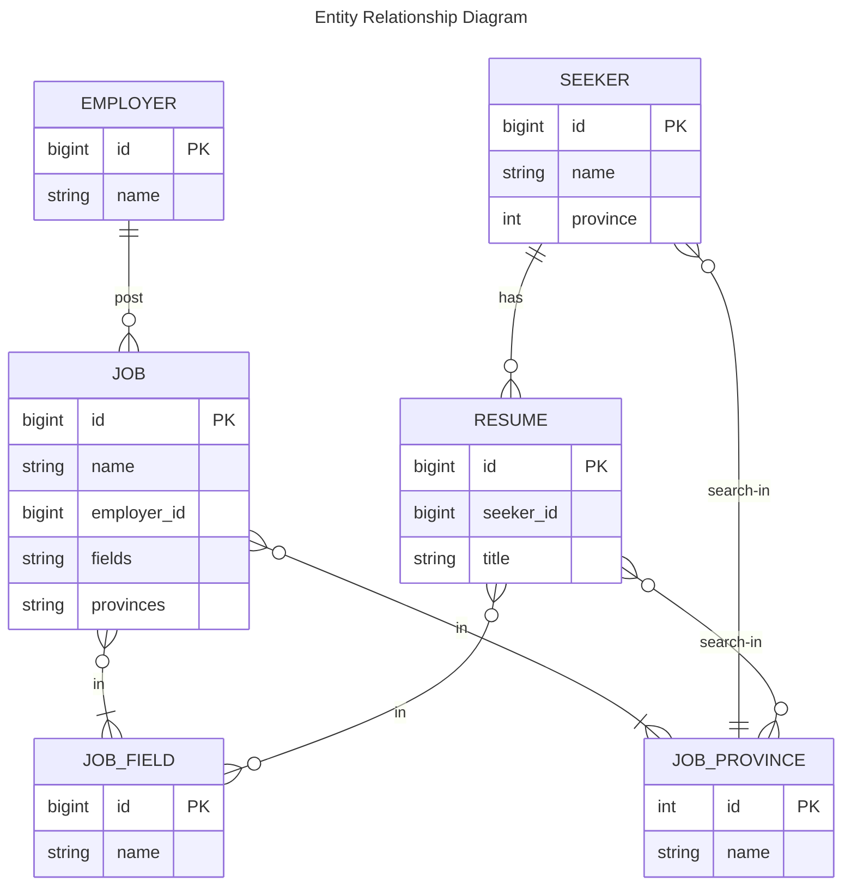

# Recruitment Service API Project Guide

## 📘 Project Overview

Welcome to our Recruitment Service API project! This comprehensive guide will walk you through the development of a sophisticated job recruitment system that connects employers, job seekers, and job opportunities.

## 🗺️ Entity Relationship Diagram



## 🧩 System Entities Explained

### 1. Employer
Imagine an employer as a company or organization looking to hire new talent. In our system:
- An employer can post multiple job listings
- Each employer has a unique identifier and name
- Example: "TechInnovate Solutions" might be an employer posting jobs for software developers

### 2. Job
Jobs are the heart of our recruitment platform:
- Represents a specific job opening
- Must be associated with one or more job fields (like "Software Development" or "Marketing")
- Must specify one or more provinces/regions where the job is available
- Example: A "Senior Java Developer" position in Ho Chi Minh City

### 3. Seeker
Job seekers are professionals looking for new opportunities:
- Can create multiple resumes
- Associated with a specific province where they're searching for work
- Example: A software engineer looking for jobs in Hanoi

### 4. Resume
A resume is a professional's calling card:
- Created by a single seeker
- Can be linked to multiple job fields
- Can target multiple provinces
- Example: A comprehensive CV highlighting a developer's skills and experience

### 5. Job Field
Think of job fields as professional categories:
- Pre-populated with existing data
- Provides a standardized way to categorize jobs and resumes
- Examples: "Software Engineering", "Marketing", "Sales"

### 6. Job Province
Represents geographical regions:
- Pre-populated with existing data
- Helps in localizing job searches
- Examples: "Ho Chi Minh City", "Hanoi", "Da Nang"

## 📡 API Response Format

### Standard Response Structure
```json
{
  "errorCode": int,
  "statusCode": int,
  "message": string,
  "object": {}
}
```

| Field       | Description                    |
|-------------|--------------------------------|
| errorCode   | Error code                     |
| statusCode  | HTTP status code               |
| message     | Error description message      |
| object      | Data object to be returned     |

### Pagination Response Format
```json
{
  "page": int,
  "pageSize": int,
  "totalElements": long,
  "totalPages": long,
  "data": []
}
```

| Field          | Description                   |
|----------------|-------------------------------|
| page           | Page index                    |
| pageSize       | Number of elements per page   |
| totalElements  | Total number of elements      |
| totalPages     | Total number of pages         |
| data           | Array of returned data        |

## 🔗 Monitoring Links

### Swagger Documentation
[http://localhost:8080/swagger-ui/index.html](http://localhost:8080/swagger-ui/index.html)

### Prometheus Metrics
- Metrics Endpoint: [http://localhost:8080/actuator/prometheus](http://localhost:8080/actuator/prometheus)
- Prometheus Console: [http://localhost:9090/](http://localhost:9090/)

### Grafana Dashboard
[http://localhost:3000/](http://localhost:3000/)

## 🔒 Generating RSA Keys

### Method 1: Using OpenSSL
```sh
openssl genrsa -out private.pem 2048
openssl rsa -in private.pem -outform PEM -pubout -out public.pem
```

### Method 2: Online Tool
Use the online key generation tool: [https://mkjwk.org/](https://mkjwk.org/)

## 🐳 Docker Deployment

### Building the Docker Image
```shell
docker build -t recruiment-service:latest .
```

### Running the Docker Container
```shell
docker run --network=host -p 8080:8080 recruitment-service:latest
```

## 📚 Additional Resources

### Spring Configuration
For a comprehensive list of Spring Boot application properties, refer to:
[Spring Application Properties](https://docs.spring.io/spring-boot/docs/current/reference/html/application-properties.html)

## 🤝 Contributing

Contributions are welcome! Please feel free to submit a Pull Request.

## 📝 License

This project is open source and available under the MIT License.
